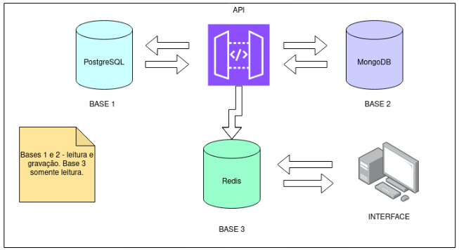

Um site de recomendação de compras precisa integrar três bases de
dados, uma relacional e outras duas NoSQL. O sistema consiste em
recomendar as compras para os amigos dos clientes. A cada compra, o
site solicita ao cliente a indicação de um amigo. Os dados dos clientes e
seus amigos são armazenados em uma base de dados orientada a
documentos.

## BASE 1: Relacional

Na primeira base de dados, a relacional, ficam armazenados os dados
dos clientes e das suas compras.
Assim, são necessárias pelo menos duas tabelas com os esquemas:
Cliente(id, cpf, nome, endereco, cidade, uf, e-mail)
Compras(codigo, produto, valor, data, id_cliente)

## BASE 2: Orientado a documentos

No banco de dados orientado a documentos, somente uma coleção é
necessária. Esta coleção deve armazenar dados dos clientes do site e de
seus relacionamentos (amigos), com o formato:
Pessoa{objectID, nome, cpf, e-mail, {amigos:[objectID1, objectID2,
objectIC3 …]}}

## BASE 3: Chave-valor

A terceira base, que será usada somente para consulta, devem ser
armazenados os dados das bases 1 e 2.
Recomendação:
nome do amigo do cliente, nome do cliente, compra do cliente, valor da
compra

## API

A API deve somente recuperar os dados das duas bases anteriores e
fazer uma junção entre eles, armazenando os dados no Redis.
Interface:
Mostrar os dados da base chave-valor.

## Testes:

Faça testes alterando os dados dos bancos de dados para demonstrar na
apresentação do trabalho. A atualização dos dados na base Redis deve
ser feita a partir da API, limpando a base de cache e replicando os dados
novamente.

